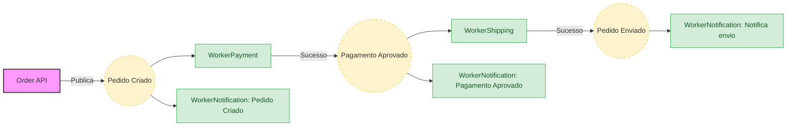

# Event-Driven Orders Lab 🚀

Este projeto é um laboratório de engenharia de software focado em **Arquitetura Orientada a Eventos** e **Resiliência**, utilizando o ecossistema Google Cloud.

O objetivo principal é demonstrar padrões avançados de mensageria, garantindo desacoplamento total entre serviços e consistência eventual.

> **Importante**: O projeto tem como objetivo seguir com o processo a partir de um pedido já "validado", e não tem como intenção fazer uma aplicação completa.

## 🏗️ Arquitetura e Fluxo

O sistema segue um fluxo reativo para processamento de pedidos:

1.  **API Gateway (Order.Api)**: Recebe a intenção de compra e retorna `202 Accepted`, publicando o evento inicial.
2.  **Fan-out (Paralelismo)**: O evento de pedido criado dispara simultaneamente o processamento de **Envio para transportadora**, **Pagamento** e **Envio de Notificação**.



## 🎯 Desafios Técnicos (Roadmap)

O projeto está estruturado em 4 níveis de complexidade crescente:

- 🟢 **Fundamental**: Setup do Pub/Sub, publicação de eventos e consumo básico.
- 🟡 **Resiliência**: Implementação de *Exponential Backoff* e **Idempotência**.
- 🔵 **Fan-out**: Distribuição de um único evento para múltiplos consumidores independentes.


## 📦 Single Source of Truth (Pedido Mock)

Todos os eventos derivam da estrutura base do pedido. O `correlationId` é obrigatório para rastreabilidade e idempotência.

```json
{
  // --- Metadados Técnicos ---
  "correlationId": "b1f8e29d-...", 
  "timestamp": "2026-02-03T21:00:00Z",

  // --- Dados do Pedido (Identificação) ---
  "pedidoId": "7e3b12a0-...",
  "status": "FINALIZADO",
  "valorTotal": 389.80,

  // --- Dados de Negócio (Naturais) ---
  "cliente": {
    "nome": "Lucas Oliveira",
    "email": "lucas.oliveira@provedor.com"
  },
  "itens": [
    { "nome": "Teclado Mecânico RGB", "quantidade": 1, "preco": 299.90 },
    { "nome": "Mousepad Gamer", "quantidade": 1, "preco": 89.90 }
  ],
  "pagamento": {
    "numeroCartao": "4532 1100 2200 3300",
    "titular": "LUCAS OLIVEIRA",
    "validade": "12/2030",
    "cvv": "123"
  }
}
```

## 🛠️ Tech Stack

- **Runtime**: .NET 8/9
- **Messaging**: Google Cloud Pub/Sub
- **Database**: MongoDB
- **Infrastructure**: Docker & Docker Compose

## 📋 Regras de Ouro do Lab

1.  **Isolamento de Dados**: Workers nunca acessam o banco de dados de outro serviço.
2.  **Idempotência Obrigatória**: Todo consumidor verifica se o `correlationId` já foi processado.
3.  **Falhe Rápido, Recupere-se**: Uso extensivo de retries para falhas transientes.

